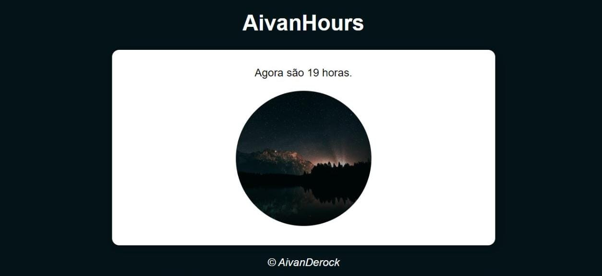

# AivanHours

O projeto AivanHours, teve sua origem atrás de um curso gratuito de JavaScript, fornecido pelo professor Guanabara, criador do canal Curso em vídeo

O projeto foi desenvolvido para mostrar habilidades com JavaScript, como podemos ver no projeto, o JavaScript se conecta com o sistema do aparelho que estiver utilizando e lê da o horário e mostra também uma foto, podendo ser de manhã, tarde ou noite.

## Demonstração

## 💻 Tech Stack:
  
  
 
 

## Material

https://www.cursoemvideo.com/curso/javascript/aulas/condicoes-em-javascript/modulos/exercicios-javascript-parte-2/

## Licença

[MIT License](https://choosealicense.com/licenses/mit/)

## Suporte

Para suporte, mande um email para ivan.rocha.0987@gmail.com ou entre em contato via whatsapp (41) 98468-5317.

## Feedback

Se você tiver algum feedback, por favor enviar para ivan.rocha.0987@gmail.com

## Autores

- [@IvanRocha](https://www.github.com/ivanrocha10)
- [@CursoEmVideo](https://github.com/gustavoguanabara)

## Projeto

  Acesse o "AivanHours" pelo QR:

  

Caso o QR não funcione, acesse <a href="https://ivanrocha10.github.io/AivanHours/">aqui</a>
